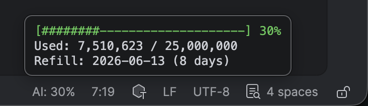

# Jaimo — JetBrains AI (Quota Usage) Monitoring

Displays your JetBrains AI quota usage directly in the IDE status bar.
Works with any JetBrains IDE (IntelliJ, WebStorm, GoLand, PyCharm, etc.).



## Features

- **Status bar widget** — compact `AI: 30%` display with color coding
- **Detail popup** — click for full breakdown: used/max tokens, progress bar, refill date
- **Auto-refresh** — updates every 5 minutes, click to refresh manually
- **Color coding** — default < 50%, yellow 50–79%, red ≥ 80%
- **Measurement points** — mark a start and end point to measure tokens consumed in any interval; persists across restarts
- **Zero network** — reads only the local IDE log file

## Install

### From distribution zip

1. Download `jaimo-0.1.0.zip` from the [`dist/`](dist/) directory
2. In your IDE: **Settings → Plugins → ⚙️ → Install Plugin from Disk…**
3. Select the zip file and restart the IDE

## Build

Requires JDK 17+.

```bash
./gradlew buildPlugin
```

The distribution zip will be generated at `build/distributions/jaimo-<version>.zip`.

To run in a sandboxed IDE for testing:

```bash
./gradlew runIde
```

## Measuring token consumption

Click the widget to open the popup, then use the button at the bottom to bracket any interval:

1. **Start** — captures the current token count
2. Code — do some agentic coding
3. Restart — restart your IDE to trigger quota state refresh
2. **End** — captures again and shows the delta: `18,143,812 → 18,456,212 = +312,400 (09:03 → 11:47)`
3. **Clear** — resets for the next measurement

The measurement persists across IDE restarts until cleared.

## How it works

Parses the current IDE's `idea.log` (via `PathManager.getLogPath()`) for `QuotaManager2Impl` entries to extract consumed/maximum tokens and next refill date. All I/O runs on a background thread — never blocks the UI.

## Requirements

- JetBrains IDE **2024.2** or newer
- JetBrains AI Assistant enabled (so quota log entries exist)
